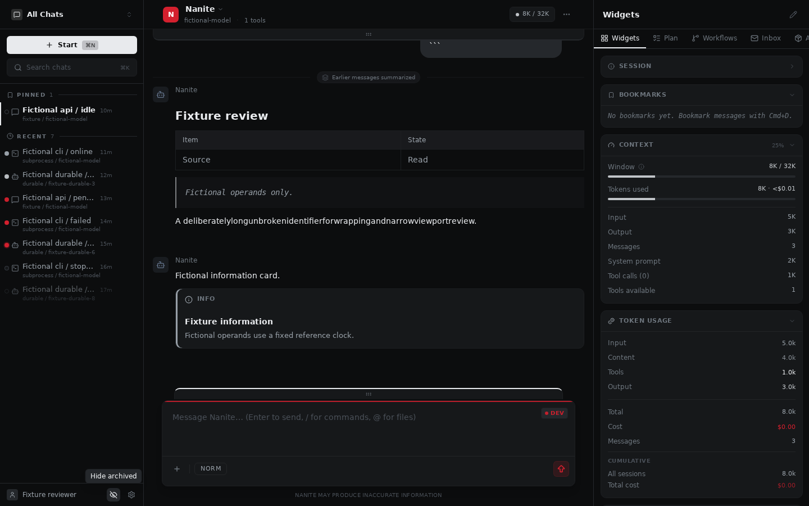
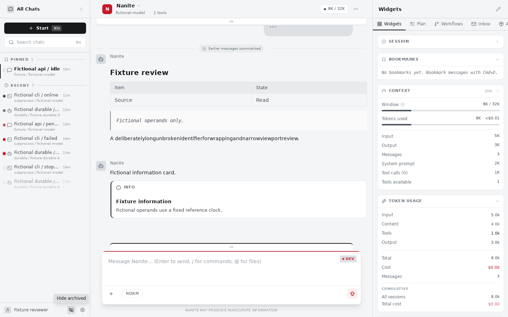
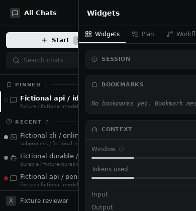
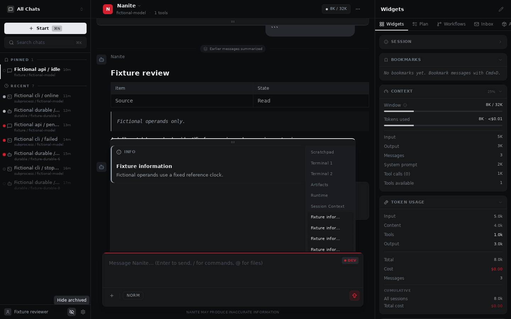
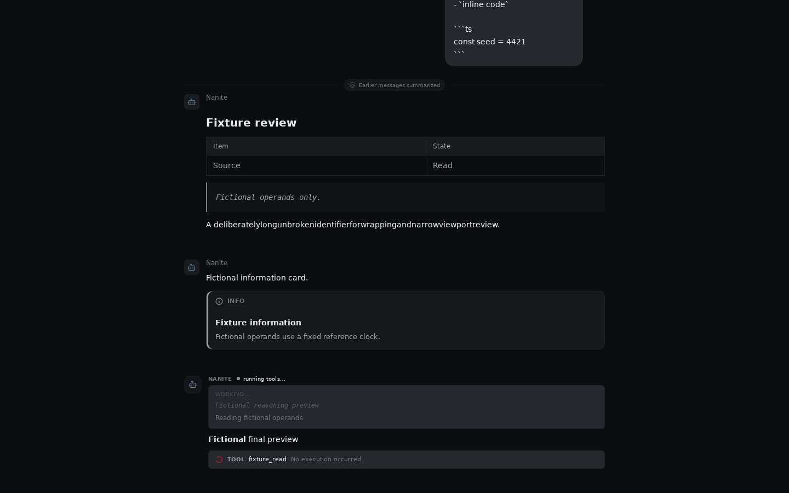
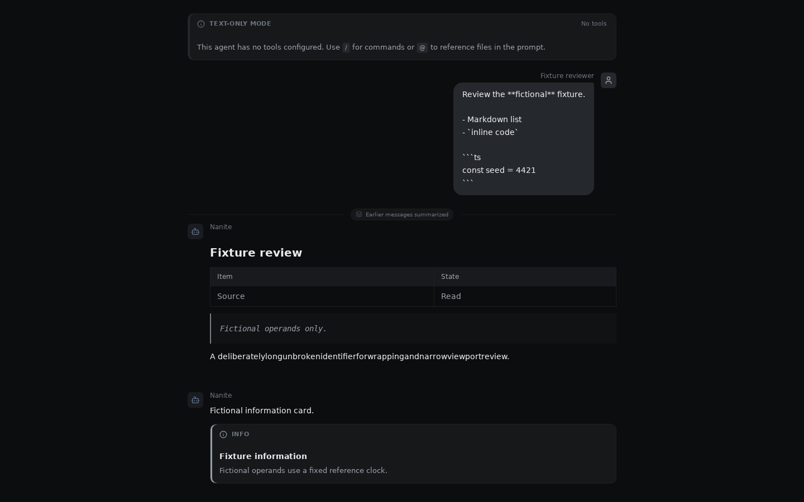
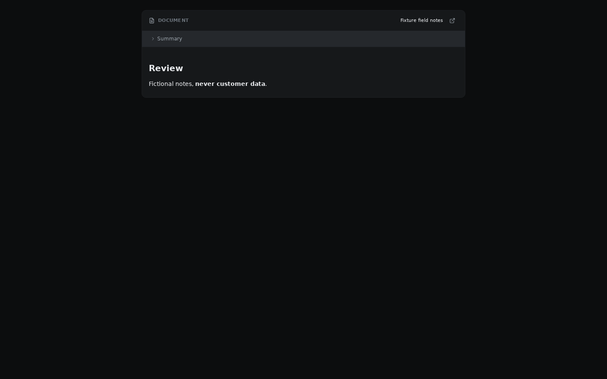
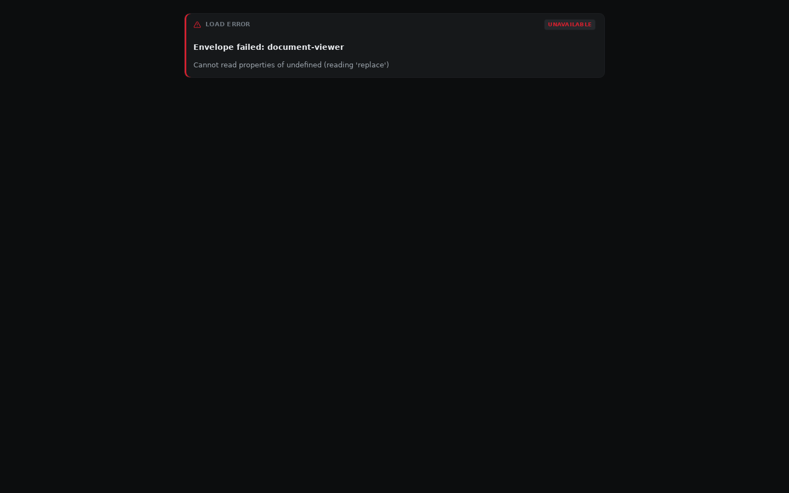
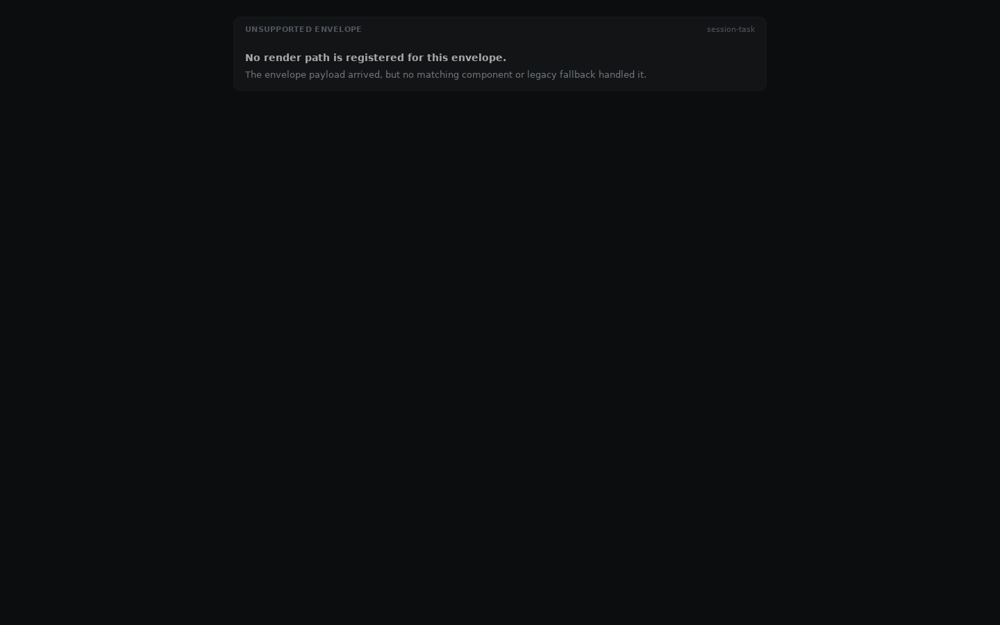
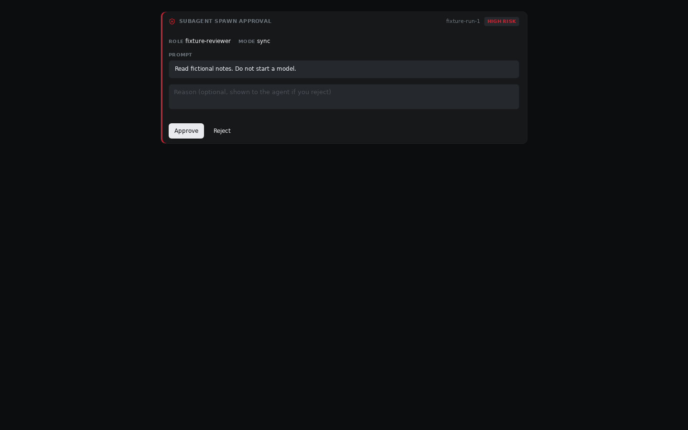

# Native Flux reference evidence

This packet accompanies [CW-20261010-0083's proposed spec](../flux-fidelity-spec.md).
It records the actual Flux source components with fictional local operands; owner
visual acceptance remains pending. [Capture index](capture-index.json) lists every
final screenshot, its SHA256, viewport, source text, boundary outcome, unavailable
adapter calls and transport observations. [All native images](captures/) are
committed so review does not depend on access to this machine.

## What was captured

The final packet combines the 85-view full pass and a two-view focused banner
supplement (86 unique selected views). The supplement scrolls the source
`.chat-scroll` container; the original driver used an absent Radix selector.
Both phases have no uncaught errors or write attempts. The packet uses Chromium and the exact source/fixture/harness receipts in
[proof manifest](proof-manifest.json). It covers:

- Source shell dark/light at 1440×900, 390×844, 1440×420 and 390×420; an additional
  default archive-hidden view precedes the source footer's archive-reveal toggle.
- Every working drawer tab, including a real source-store card tab and its
  narrow/short view; every ordinary primary drawer tab and every right rail tab.
- All **18** authored v0.4.0 envelope identities, complete and deliberately
  partial. `session-task` displays source unsupported fallback in both cases.
- Generic and subagent approval flavors at low/medium/high risk and each source
  pending/approved/rejected hydration state. No approval action is submitted.
- Source transcript markdown, compaction boundary, thinking/narration/final
  preview, text-only banner, and running/done/error tool specimens. The banner
  has a separate top-of-transcript view because source streaming autoscroll moves
  it above the viewport.

These are static views, not a product fixture-count contract. Gallery framing is
an inspection arrangement; shell images use the actual App. The source has
internal desktop-column clipping at narrow sizes even when document scrollWidth
matches viewport width. A narrow capture does not establish responsive usability.

## Results and limits

Final results are read from the capture index and manifest, not inferred from a
screenshot count. Native HTTP requests remain GET/HEAD to `127.0.0.1:18583` assets.
The route rejects remote URLs, `/api`, and other HTTP methods; service workers are
blocked. SSE, WebSocket and interval transport are disabled before source mount.
Unknown API adapter methods reject as unavailable. No backend/model is started.

Source error boundaries are part of the reference: deliberately partial
`document-viewer`, `error-report` and `subagent-spawn-approval` render failure
cards. This evidence does not imply graceful handling of incomplete producer
payloads. `session-task` is a backend-only type with no visual binding. Complete
and approval data validate against their pinned primary schemas; every partial
omits at least one required field.

The adapter explicitly supplies an inert tool, disconnected fictional server,
8,000 fictional tokens, 32,000 context ceiling and fictional zero estimated cost.
Its known-empty bookmarks/execution slices are distinct from unavailable
`getStartSurfaceCapabilities`, `getSessionContextPrompt` and `listPins`. Runtime
and terminal tabs are inert source placeholders, not evidence of live host-feed
behavior. Worker/observability and other widget operands in the fixture inventory
include **proposals**, not claims that each proposed slice was mounted by Flux.
The replay adapter shows the exact source API field names used in captures.

Flux declares Inter and JetBrains Mono without bundled webfont files. Captures
use the retained local system font set and disclose fallback typography. Fixed
reference time is 2026-10-04T14:30:00Z; seed is 4421. Native streaming cadence,
countdowns, SSE reconnection, provider behavior, touch/IME, keyboard accessibility,
backend persistence and ten-theme recreation acceptance remain outside this proof.

Earlier exploratory packets remain in owned `.scratch/flux-fidelity`:
`native-first-pass.json` records a transcript harness error caused by reading a
stale store snapshot after session initialization; `second-pass` retains the
subsequent pass before an incomplete context-inspector cost operand was corrected.
`native-explicit-first.json` records an incorrectly selected row Archive icon:
its `updateSession` attempt was rejected by the in-memory read-only guard before
network. The final pass scopes the source footer toggle, supplies the complete
widget operand and reads the initialized store snapshot. These corrections touch
only the temporary harness; no Flux product source is changed.

## Selected native views





















## Replay on the retained environment

The [replay directory](replay/) contains the exact final temporary entry, API/query
adapters, Vite configuration, fonts configuration and native capture driver.
`fixture-operands.json` is the generator output, copied without modification into
Flux's owned `.scratch`. Paths below are the retained machine paths; another
machine must replace the toolkit/font/browser paths in the driver and fonts file.
No claim of portable font equivalence is made.

```bash
PARALLAX_ROOT=/home/chrispian/dev/hollis-labs/worktrees/parallax/CW-20261010-0083
FLUX_ROOT=/home/chrispian/dev/hollis-labs/worktrees/flux/CW-20261010-0083
TOOLKIT_READONLY=/home/chrispian/dev/hollis-labs/worktrees/parallax/CW-20261009-0007/.scratch/operations-audit-tooling
export PATH="$TOOLKIT_READONLY/node-v22.19.0-linux-x64/bin:$PATH"

# Verify source heads against proof-manifest.json before replay.
git -C "$FLUX_ROOT" rev-parse HEAD
git -C "$FLUX_ROOT" status --short
mkdir -p "$FLUX_ROOT/.scratch/flux-fidelity"
cp "$PARALLAX_ROOT/docs/flux-fidelity/replay/"{api.ts,query.ts,entry.tsx,vite.config.ts,fixture.html} "$FLUX_ROOT/.scratch/flux-fidelity/"
cp "$PARALLAX_ROOT/docs/flux-fidelity/fixture-operands.json" "$FLUX_ROOT/.scratch/flux-fidelity/"
cd "$FLUX_ROOT"
npm ci --ignore-scripts --no-audit --no-fund --cache "$PARALLAX_ROOT/.scratch/flux-fidelity/npm-cache"
node node_modules/vite/bin/vite.js --config .scratch/flux-fidelity/vite.config.ts
```

The last command starts only the fixture asset server. In a second owned shell:

```bash
PARALLAX_ROOT=/home/chrispian/dev/hollis-labs/worktrees/parallax/CW-20261010-0083
TOOLKIT_READONLY=/home/chrispian/dev/hollis-labs/worktrees/parallax/CW-20261009-0007/.scratch/operations-audit-tooling
cd "$PARALLAX_ROOT"
mkdir -p .scratch/flux-fidelity/browser-home .scratch/flux-fidelity/font-cache
cp docs/flux-fidelity/replay/capture.cjs .scratch/flux-fidelity/capture-final.cjs
cp docs/flux-fidelity/replay/fonts.conf .scratch/flux-fidelity/fonts.conf
HOME="$PARALLAX_ROOT/.scratch/flux-fidelity/browser-home" \
FONTCONFIG_FILE="$PARALLAX_ROOT/.scratch/flux-fidelity/fonts.conf" \
PLAYWRIGHT_BROWSERS_PATH="$TOOLKIT_READONLY/browsers" \
LD_LIBRARY_PATH="$TOOLKIT_READONLY/libs/usr/lib/x86_64-linux-gnu" \
heavytest "$TOOLKIT_READONLY/node-v22.19.0-linux-x64/bin/node" \
  .scratch/flux-fidelity/capture-final.cjs

# For the separately retained explicit banner/narrow supplement, copy
# replay/capture-banner.cjs into the same scratch directory and invoke it
# through heavytest with the same environment. capture-full-observed.cjs
# is the historical full-pass driver, not the corrected replay default.
```

Package acquisition is authorized build work, separate from the browser runtime
boundary. Do not launch source `npm run dev`, its generators, Nanite, a provider
or a model CLI. Stop only this owned listener when finished. The full and banner-supplement raw final
JSON/log, earlier exploratory packets and a hashed proof archive are retained in
this task's own `.scratch/flux-fidelity`; they are not another agent's old proof.
