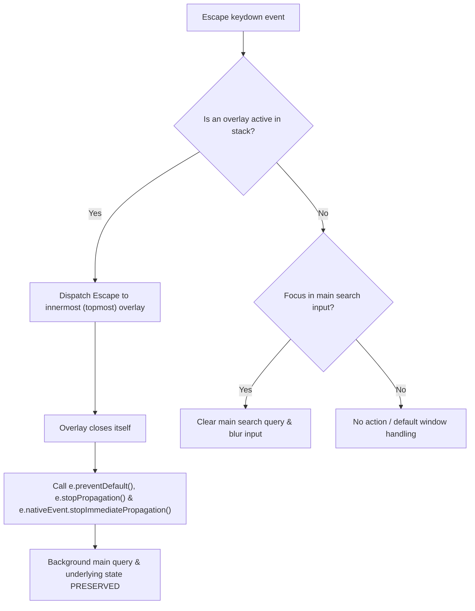
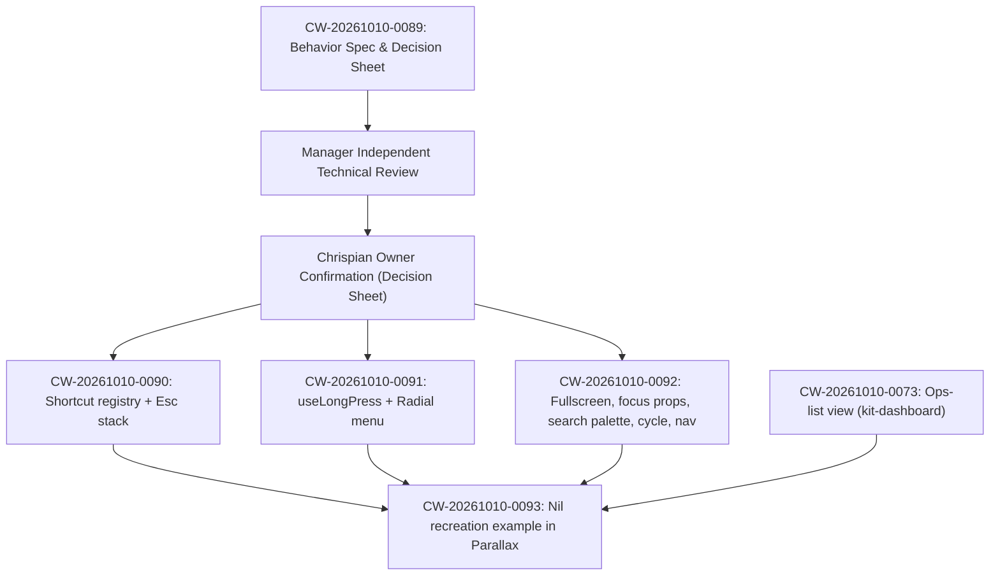

# Nil keyboard and interaction behavior specification

CW-20261010-0089 · EP-20261010-0006 · **proposal for owner review in Parallax**.

This document specifies the keyboard interaction, focus orchestration, shortcut hierarchy,
Escape layering, radial menu mechanics, and palette navigation derived from `apps/nil`
(commit `cab453268482bf0b60df5820bb337a77e2ff841b`) for adoption in Parallax recreations
and future design-kit primitives.

This deliverable is a **specification and design proposal**. It introduces no product code
changes, no npm package releases, and no deployment. Downstream implementation belongs to
CW-20261010-0090, -0091, -0092, and the Nil example -0093. Owner confirmation of the proposed
defaults ([`docs/nil-decision-records.md`](nil-decision-records.md)) is required before downstream
implementation begins.

---

## 1. Evidence and authority

Primary source was inspected in owned worktrees from fetched `origin/main`:

| Repository | Reference | Git object | Role |
| --- | --- | --- | --- |
| `nil` (`apps/nil`) | Source head | Commit `cab453268482bf0b60df5820bb337a77e2ff841b` | Primary source audited across 12 topics. See [`docs/nil-source-survey.md`](nil-source-survey.md). |
| `parallax` | Source head | Commit `70afd38a3b31b409ee5d267083ce3b7f9d3fe75a` | Host of recreation examples, inspection extractions, and docs (`origin/main`). |
| `design-kit` | PR 102 merge commit | Commit `1dc83f98098a93ecf300dc5b3999bfe542efc7a7` | Landed candidate on `main`. |
| `design-kit` | PR 102 source head | Commit `62c066cfe6a6547969e85745d969929240e3dcb6` | Author candidate head. |
| `design-kit` | Pinned package tree | Tree `d1e6241b9fb735ccce3b627bf913515574e72c61` | Pinned tree in local tarball `0.4.0-cw0036`. |

### Extraction receipts: reuse, not duplication

This specification builds directly upon landed Parallax extraction receipts and precedent documents:
1. **Bounded inspection chrome (CW-20261010-0035, [`docs/inspection-extraction.md`](inspection-extraction.md))**:
   Public-root `InspectionDialog` from `@hollis-labs/design-components` (PR 5, `706e90b3bfb7f9df2a329217ca45d0eb01403511`).
   Establishes pinned viewport-bounded chrome, single body scroll region, controlled open/close,
   and forwarded popup event handlers.
2. **Controlled record navigation (CW-20261010-0036, [`docs/navigation-extraction.md`](navigation-extraction.md))**:
   Public-root `useControlledRecordNavigation` hook (PR 7, `70afd38a3b31b409ee5d267083ce3b7f9d3fe75a`).
   Establishes bubble `popupHandlers` for `ArrowLeft` / `ArrowRight` record navigation,
   composition start/end capture, caller-owned source admission, and `wrap` vs `stop` boundary policies.
3. **Operations shell and list anatomy (CW-20261010-0070, [`docs/ops-shell-template-spec.md`](ops-shell-template-spec.md))**:
   Merged in PR 6 (`bb6f11970b38aeb803e8cad2f9fb7af2c38cbd82`). Establishes two-column template
   proposals, keyboard arbitration rules, and the propose-then-confirm discipline under DEC-073.
4. **Operations keyboard audit ([`docs/ops-dashboard-review.md`](ops-dashboard-review.md), [`frontend/tests/torque-keyboard.spec.ts`](../frontend/tests/torque-keyboard.spec.ts))**:
   Establishes the robust keyboard guard pattern (`Operations.tsx:234-248`), IME composition
   suppression, and deterministic Playwright test suites.

---

## 2. Core behavioral specifications

### 2.1 Keyboard interaction model & shortcut hierarchy

Global keyboard shortcuts must adhere to strict hygiene to avoid intercepting native browser
controls, colliding with text typing, or executing during IME composition.

#### The standard keyboard guard pattern
Every shortcut listener outside an active text input MUST evaluate the established guard pattern
(aligned with `Operations.tsx:234-248`):

```typescript
function isEventGuarded(e: KeyboardEvent): boolean {
  if (e.defaultPrevented) return true;
  if (e.isComposing || e.keyCode === 229) return true;

  // Guard against active text inputs, textareas, and contenteditables
  const target = e.target;
  if (
    target instanceof Element &&
    target.closest(
      'input, textarea, select, button, a, [contenteditable]:not([contenteditable="false"]), [role="textbox"], [role="combobox"], [role="searchbox"], [role="slider"], [role="spinbutton"]'
    )
  ) {
    return true;
  }

  // Guard against active dialogs or open menus if shortcut belongs to base shell
  if (document.querySelector('[role="dialog"][aria-modal="true"], [role="menu"]')) {
    return true;
  }

  return false;
}
```

#### Shortcut hierarchy and registration
Shortcuts are categorized into four strict priority tiers:

| Tier | Scope | Handlers | Precedence rule |
| --- | --- | --- | --- |
| **Tier 1: Overlay Dismissal** | Active overlay / modal | `Escape` | Consumed exclusively by topmost active overlay; stops propagation. |
| **Tier 2: Component-Local** | Focused widget (combobox, table row, radial menu) | `ArrowUp`, `ArrowDown`, `ArrowLeft`, `ArrowRight`, `Enter`, `Space`, `Tab` | Governed by widget ARIA role; never propagates to global listeners. |
| **Tier 3: Formatted / Mode** | Focused editor / row | `Cmd+Enter` (submit), `Cmd+S` (save in place), `p` / `a` / `d` (row triage) | Active only when focused on eligible target; never attached to window. |
| **Tier 4: Global Shell** | Entire application | `Cmd+K` (search), `Shift+Shift` (search alias), `Cmd+Shift+V` (vault), `Cmd+,` (settings) | Evaluated only when Tier 1–3 do not consume and `isEventGuarded()` is false. |

---

### 2.2 Layered Escape stack architecture

To eliminate Nil's accidental cross-layer query clearing risk (`nil-source-survey.md` Topic 3,
where closing `QuickSearchModal` risked clearing the background search query via `handleClearAll`),
Parallax specifies a centralized **LIFO Layered Escape Stack**.



#### Layered Escape contracts
1. **Innermost first:** Only the topmost entry on the overlay stack receives the `Escape` event.
2. **Immediate event consumption:** The handling overlay MUST invoke `e.preventDefault()`,
   `e.stopPropagation()`, and `e.nativeEvent?.stopImmediatePropagation?.()`.
3. **Background query retention:** Closing an overlay MUST NEVER clear, reset, or alter the
   underlying page query, filter bar, or selection state.
4. **Base-level Escape:** When no overlays are present in the stack:
   - If the main search input is focused and contains text, `Escape` clears the query.
   - If the main search input is focused and empty, `Escape` blurs the input and returns focus
     to the last selected list/table row.

---

### 2.3 Focus entry, trap, and return contract

All dialogs, drawers, and modal palettes MUST conform to accessible dialog requirements:

1. **Focus Entry:**
   - On open, focus is programmatically shifted to a designated initial element within the modal.
   - For `QuickSearchPalette`: initial focus is the `<input role="combobox">` element immediately upon mount.
   - For `InspectionDialog`: initial focus defaults to the first interactive action button or
     readable title element, as configured by caller props.
2. **Focus Trap:**
   - Active modals MUST trap keyboard focus. Pressing `Tab` from the last focusable element in
     the modal wraps to the first; pressing `Shift+Tab` from the first wraps to the last.
   - Background DOM elements outside the modal MUST be marked `aria-hidden="true"` or inert.
3. **Focus Return:**
   - The component opening the modal MUST capture `document.activeElement` prior to opening.
   - Upon dismissal (via `Escape`, close button, backdrop click, or action execution), focus
     MUST be returned to the captured triggering element.
   - If the triggering element was removed from the DOM during the modal's lifetime or is disconnected,
     focus falls back to the nearest parent container or the main list element.

---

### 2.4 Quick search palette (`Cmd+K` / `Shift+Shift`)

Derived from Nil's `QuickSearchModal.tsx`, the search palette provides instantaneous search
and item activation across todos, notes, and scratchpads.

#### Activation shortcuts
- **Primary:** `Cmd+K` (macOS) / `Ctrl+K` (Linux/Windows) per DEC-NIL-01.
- **Alias (proposed):** `Shift+Shift` (two consecutive Shift key taps within 300ms).
  - Timing window: 300ms (recommended default).
  - Guard: Ignored if `e.target` is an editable field, or during IME composition
    (`isComposing === true` or `keyCode === 229`), or if modifiers (`altKey`, `ctrlKey`, `metaKey`)
    are held.
  - Reset: Any non-Shift key immediately resets the tap window to zero.

#### Search input & caret retention (W3C ARIA 1.2 Combobox pattern)
- The text input itself is the focus owner and carries the combobox semantics:
  - Focused input element:
    `<input type="text" role="combobox" aria-expanded="true" aria-haspopup="listbox" aria-autocomplete="list" aria-controls="search-results-listbox" aria-activedescendant={activeId ? `opt-${activeId}` : undefined} ... />`
  - Results container:
    `<div id="search-results-listbox" role="listbox" aria-label="Search results" ... />`
  - Result options:
    `<div id={`opt-${id}`} role="option" aria-selected={isActive} ... />`
- **Arrow navigation mechanics:**
  - `ArrowDown` / `ArrowUp` keydown events are caught on the input element.
  - `e.preventDefault()` is called to prevent vertical caret movement in the input.
  - Active index state updates immediately, updating `aria-activedescendant` on that same input.
  - The highlighted option scrolls smoothly into view (`scrollIntoView({ block: "nearest" })`).
  - **DOM focus remains continuously inside the text input**, keeping the text caret visible
    and ready for continued typing.

#### Filter chips
- Filter chips (All, Todos, Notes, Scratch) are rendered below the input as an accessible
  radiogroup:
  - Container: `role="radiogroup"`, `aria-label="Filter result types"`.
  - Chips: `<button role="radio" aria-checked={isActive} tabIndex={isActive ? 0 : -1} ... />`.
- **Keyboard navigation:**
  - When focus is in the chip group, `ArrowLeft` / `ArrowRight` cycles through chips.
  - Proposed default for direct keyboard switching while typing in the input: `Tab` moves focus
    to the active filter chip; alternatively, `Alt+1` through `Alt+4` can be bound as an explicit
    proposal (using `Alt` to prevent browser tab switching collisions with `Ctrl+1..9`).

---

### 2.5 Radial menu component contract

Derived from Nil's `RadialMenuWrapper.tsx` and `TerminalList.tsx`, the radial menu provides
rapid inline action dispatch for cards and rows.

#### Geometry and design-kit token mapping
- **Geometry (component exception):**
  - Radius: 60px from center anchor to item centers.
  - Center button: 35px diameter circular button (`×` to close, `←` to return from sublayer).
  - Action buttons: 35px diameter circular buttons.
  - Bounding clearance radius: 85px (total diameter 155px plus safety padding).
- **Design-kit token styling:**
  - Menu surface: `var(--color-bg-panel)` with `var(--color-border-subtle)` border.
  - Action button: `var(--color-bg-subtle)` background, `var(--color-text-primary)` text,
    `var(--radius-full)` border radius.
  - Active/hover state: `var(--color-accent-subtle)` or `var(--color-interactive-hover)`.
  - Typography: `var(--font-mono)` with scale token `var(--text-xs)` (8px–10px).
- **Items:**
  - Todo main layer (8 items):
    `NOW` (0°, top), `SOON` (45°), `ANY` (90°, right), `DEL` (135°), `EDIT` (180°, bottom),
    `DONE` (225°), `MORE` (270°, left), `PIN` (315°).
  - Note main layer (5 items):
    `EDIT` (0°), `→TODO` (60°), `DEL` (120°), `PIN` (180°), `COPY` (270°).
  - More sublayer (4 items):
    `ARCH` (90°), `COPY` (150°), `META` (210°), `→NOTE` (270°).

#### Timing, cancellation, and click suppression
- **Hold threshold:** 1000ms initial hold duration (proposed default).
- **Pointer cancellation:** Hold timer is cancelled immediately upon:
  - `mousemove` or `touchmove` exceeding 8px displacement from initial touch point.
  - `mouseleave` or pointer cancellation.
- **Post-hold click suppression:**
  - Upon hold completion (1000ms), a flag `holdTriggered.current = true` is set.
  - When the user releases pointer/touch, the subsequent synthetic `click` event is intercepted
    and cancelled (`e.preventDefault()`, `e.stopPropagation()`).
  - This eliminates the Nil risk where mouse release after long-press triggered the underlying row's
    `onClick` and opened `EditItemModal`.
- **Viewport clamping:**
  - The menu center coordinate `(x, y)` is clamped so the 85px radius bounding circle remains
    fully visible within the viewport:
    $$x_{\text{clamped}} = \max(85, \min(x, \text{window.innerWidth} - 85))$$
    $$y_{\text{clamped}} = \max(85, \min(y, \text{window.innerHeight} - 85))$$

#### Keyboard accessibility
- **Trigger:** When focus is on a list row, pressing `Shift+F10`, the native context menu key,
  or `m` opens the radial menu centered on the focused row.
- **Navigation:**
  - Focus moves into the radial menu root (`role="menu"`).
  - `ArrowRight` / `ArrowDown` steps clockwise to the next action wedge; `ArrowLeft` / `ArrowUp`
    steps counterclockwise.
  - `Enter` or `Space` executes the selected action and closes the menu.
  - `Escape` dismisses the menu and **restores keyboard focus to the triggering row** (with fallback
    to list container if row is unmounted).

---

### 2.6 View mode cycle button & input-mode controls

#### 3-way app mode cycle button
- **Functionality:** Cycles display mode: `todos` → `notes` → `all` → `todos`.
- **Visual presentation:** Badge button using design-kit tokens (`bg-panel`, `border-subtle`,
  `text-primary`) displaying current mode icon and label (`CheckSquare` for Todos, `FileText` for
  Notes, `Layers` for All).
- **Short click:** Advances to next mode in 3-cycle.
- **Long press (1000ms):** Sets `longPressFired = true` and opens Settings navigated to the "tabs" tab.
  Click event on mouseup is suppressed if long press fired.
- **Accessibility:** `role="button"`, `aria-label="Switch view mode (current: Todos). Long-press for tab settings."`

#### Input-mode toggle & syntax resolution
- **Functionality:** Toggles the header entry bar between **Search mode** and **Quick Add mode**.
- **Visual presentation:**
  - In Add mode: displays `<Plus size={16} />`, tooltip: *"Quick Add Mode (Click to switch to Search)"*.
  - In Search mode: displays `<Search size={16} />`, tooltip: *"Search Mode (Click to switch to Quick Add)"*.
- **Proposed interpretation of "+/@" wording:**
  - Old Nil contained no literal "+/@" button. The button beside search is the Search/Plus mode toggle.
  - Beside it sits the Session Context button (`<Target size={16} />`).
  - Nil's capture syntax uses `+` for projects and `@` for contexts.
  - The specification retains the explicit `Search` / `Plus` mode toggle and introduces an
    optional syntax token menu for inserting `+project` and `@context` filters, seeking owner confirmation.

---

### 2.7 Unified Inbox & Operations row interaction

| Key | Context | Behavior |
| --- | --- | --- |
| `Enter` | Row focused (`e.target === e.currentTarget`) | Inspects / opens record detail dialog (preserves `Operations.tsx` baseline). |
| `Space` | Row focused | **Baseline:** inspects record (per `Operations.tsx:619`). **Proposed alternative:** in Inbox view, toggles selection checkbox. |
| `p` | Row focused in Inbox view | **Process:** moves inbox item to active/today list. |
| `a` | Row focused in Inbox view | **Archive:** archives the item. |
| `d` | Row focused in Inbox view | **Delete:** deletes or prompts deletion for the item. |
| `ArrowUp` / `ArrowDown` | Table or list | Moves roving focus to adjacent row. |

*Crucial rule:* `p`, `a`, and `d` are active **only when focus is directly on the row element**
with roving tabindex. They are NEVER registered on `window` and NEVER active inside inputs or during IME.

---

### 2.8 Directional navigation matrix (Lists, Dialogs, Boards)

To resolve directional ambiguity across the suite, Parallax specifies an orthogonal 2D model:

```
                        ▲  ArrowUp (Previous row in list / card above in board)
                        │
◄── ArrowLeft ──────────┼────────── ArrowRight ──►
(Prev record in dialog /│ (Next record in dialog /
 prev column in board)  │  next column in board)
                        │
                        ▼  ArrowDown (Next row in list / card below in board)
```

1. **Vertical lists and tables:**
   - `ArrowUp` / `ArrowDown` moves vertical selection across rows.
   - `ArrowLeft` / `ArrowRight` is ignored or reserved for cell-level horizontal navigation.
2. **Inspection and detail dialogs (`InspectionDialog`):**
   - Consumes Parallax extraction `useControlledRecordNavigation` (`TaskInspection.tsx:51-96`).
   - `ArrowLeft` / `ArrowRight` navigates previous / next record along the admitted sequence.
   - Supports explicit `boundaryPolicy: "wrap" | "stop"`.
   - `ArrowUp` / `ArrowDown` scrolls the modal body or navigates internal form fields.
3. **Multi-column boards (kanban):** Proposed model:
   - `ArrowLeft` / `ArrowRight` moves focus horizontally between columns / swimlanes.
   - `ArrowUp` / `ArrowDown` moves focus vertically between cards within the column.
4. **Precedence:** When an inspection dialog is open over a board or table, the dialog's
   `ArrowLeft` / `ArrowRight` record navigation takes precedence and consumes the event.

---

### 2.9 Fullscreen dialog contract & session persistence

Derived from Nil's `EditItemModal.tsx:59-62`, expanded to all dialogs per DEC-NIL-03:

- **Affordance:** A header action button rendering `<Maximize2 size={13} />` (when bounded) or
  `<Minimize2 size={13} />` (when fullscreen), with `aria-label="Toggle fullscreen"`.
- **Transitions and geometry:**
  - Bounded (default): width uses scale token `var(--modal-max-w, 720px)`, max-height bounded
    to dynamic viewport with `var(--radius-lg)` border radius.
  - Fullscreen: `width: 100vw; height: 100vh; border-radius: 0; border: none; inset: 0;`.
- **Persistence policy:**
  - **Proposed default:** Resets to bounded default size on every opening (matching the author's
    stated comment intent, preventing unexpected full-screen takeover).
  - **Opt-in session persistence:** If confirmed by owner, store preference in `sessionStorage`
    keyed by dialog archetype (`parallax.dialog.fullscreen.<archetype>`), persisting across
    openings within the session and clearing upon tab close.

---

## 3. Deterministic fixtures and verification contracts

All future illustrative fixtures, automated tests, and verification runs derived from this
specification MUST adhere to the project's reproducibility rules:

1. **Seed and reference clock:**
   - Deterministic fixture seed: **`4421`**.
   - Fixed reference timestamp: **`2026-10-04T14:30:00Z`**.
   - **`Date.now()` is strictly forbidden** in all fixture generators, test assertions, and runtime
     event timestamps.
2. **Styling and tokens:**
   - Token-only rule: spacing, typography, and palette must reference design-tokens
     (`@hollis-labs/design-tokens` 0.4.0), with no arbitrary color or sizing literals.
3. **Synthetic vs native event claims:**
   - Automated tests using synthetic `isComposing`, `keyCode: 229`, or simulated Touch events
     prove event forwarding and state logic only.
   - They do **not** claim validation of native OS IME platforms or physical touchscreen hardware.
4. **Data custody:**
   - Isolated fictional test fixtures only; zero real customer data, live tracker databases,
     or external network access.

---

## 4. Downstream admission and sequence

This document is the design deliverable for CW-20261010-0089. Downstream tasks must observe
the following dependency and authority gates:



- **Scope boundary:** No npm publishing, no version bumps, no credentials, and no implementation
  of downstream tasks 0090–0093 under this task.
- Merge of these specification documents represents technical review readiness, while owner
  acceptance remains separate.
