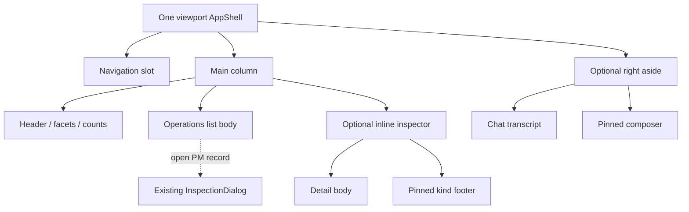

# Operations shell: Storybook-ready anatomy

Companion to [the specification](ops-shell-template-spec.md), CW-20261010-0070.
**Draft story blueprint, not a runnable component or exported kit API.**
CW-20261010-0074 implements this owner-review venue; -0076/-0077 supply routes.
The blueprint fixes slots, fixture operands, controls and behavior expectations
so implementation does not have to invent the review anatomy again.

## Desktop composition

```text
┌─────────┬─────────────────────────────────────────┬───────────────────┐
│ nav     │ shell header: route / review / aside     │ Assistant heading │
│         ├─────────────────────────────────────────┤ Collapse          │
│         │ page heading + route actions             ├───────────────────┤
│         │ search / counts / density / clear        │ transcript        │
│         │ chips / cycle / entity facets            │ independent scroll│
│         ├───────────────────┬─────────────────────┤                   │
│         │ list body        │ inline detail       │                   │
│         │ own scroll       │ named body scroll   │                   │
│         │ dense rows       │ optional per route  │                   │
│         │ Show more        ├─────────────────────┼───────────────────┤
│         │                  │ fixed kind actions  │ composer          │
│         ├───────────────────┴─────────────────────┤                   │
│         │ admitted / matched / revealed / selected │                   │
└─────────┴─────────────────────────────────────────┴───────────────────┘
```

Two content columns: **main + optional right aside**. The nav is shell chrome.
The inline list/detail subdivisions are unequal and entirely within main;
Portfolio Manager replaces that detail subdivision with a modal. No third
equal-width column. Regions share height containment, not scroll position.
The initial Tangent variant retains the aside region with an **empty body**.



At 390px, main shows list **or** inline detail with Back to list; the aside
toggle opens a right OverlaySidebar. Body uses the sidebar's scrolling slot,
composer uses footer. No simultaneous desktop/overlay copy of the same content.
Navigation drawer, chat drawer and inspector cannot compete for the same key.

## Slot recipe

The following is **composition notation** for future local fixture code. Names
with `Draft` are local story adapters, not proposed new kit primitives. Only
AppShell aside props and ops-list orchestration are new seams under review.

```tsx
<DraftShellReview state={args} preferenceStore={memoryPreferences}>
  {/* proposed aside props are specified separately, not shipped in 0.4.0 */}
  <AppShell nav={existingNavigation} header={fixtureReviewHeader}>
    <DraftOperationsComposition
      header={routeHeadingAndActions}
      search={paneScopedSearch}
      facets={facetRegistry}
      table={existingDataTable}
      inspector={args.inspectorMode === 'inline' ? inlineKindDetail : null}
      footer={projectionCounts}
    />
  </AppShell>
  {/* use the exact delivered API, not a replacement dialog/hook */}
  <InspectionDialog open={modalOpen} onOpenChange={guardedOpenChange}
    title={recordTitle} meta={sourceMetadata}
    navigation={previousPositionNext} navigationLabel="Record navigation"
    bodyProps={{ 'aria-label': 'Record detail', tabIndex: 0 }}
    footer={kindSupportedActions} {...navigation.popupHandlers}>
    {kindBody}
  </InspectionDialog>
</DraftShellReview>
```

`navigation` is -0036's exact controlled hook result; record/source/action/focus
guards remain local host code. Inline mode omits popupHandlers. Gate this recipe
on actual extraction consumption; a source merge alone does not make these
imports available from the installed 0.4.0 package. No replicated chrome or
navigation algorithms in the local adapters.

## Deterministic review operands

Seed **4421**, reference **2026-10-04T14:30:00Z**. Fictional entities only.
Author a bounded local array, not a live tracker export/API. Each item has a
unique opaque ID, recorded UTC, category, lifecycle, optional **provenance-tagged**
metadata and capability flags. All derived ages use the reference clock.
Use existing fixture conventions and local immutable artifacts; no fixture
network, polling/SSE, model CLI, `Date.now()`, real backend writes or customers.

| Fictional operand | Purpose |
| --- | --- |
| `fixture-approval-a`, 14:28Z, pending, unread | Approval kind, readable fixed approve/deny footer; bulk-dismiss exclusion. |
| `fixture-doc-a`, 14:27Z, acknowledged, read | System document badge, participant tag specimen, copy ID/locator. |
| `fixture-turn-a`, 14:26Z, presented, routed | Replyable annotation 1.2 / stage trace / origin specimen; accepted and delivered shown separately. |
| `fixture-publication-a`, 14:25Z, resolved, publication | Original origin/source kind retained, no reply controls; comment proposal distinct. |
| `fixture-workflow-a`, 14:24Z, unknown | Unknown kind/status, no fabricated action capabilities. |
| `fixture-doc-missing`, 14:23Z | Project/workstream/session absent; Unspecified filter. |
| `fixture-turn-conflict`, 14:22Z | Two explicitly authored disagreeing metadata claims; Conflict, no winner. |
| `fixture-channel-a`, last message 14:29Z | Unread/needs-input counts and main conversation; original channel delivery vocabulary. |
| `fixture-pm-a`, updated 14:21Z | PM modal record with fictional typed edges, no live tracker path. |

For reveal proof author at least 51 **fictional** admitted rows so the first
50 and one additional row are observable; this is a test operand, not a promise
that fixture/source files contain a permanent count. Include one long Unicode
title, long unbroken identifier, zero optional count, missing count, duplicate-ID
error scenario and a separately authored same-ID/new-generation source.

Fixture actions open an explicit transient candidate-intent inspection and
report that records/delivery remain unchanged. Copy specimen writes only its
fictional ID/relative fixture URL after an explicit click, with failure state.
Read/tag/dismiss/comment specimens remain local presentation simulations;
unsupported contract capabilities have a visible reason. No invented server
response, resolved approval or delivered message after pressing a control.

## Story controls and exports

Proposed title `Templates/Operations Shell`, fullscreen portable stories.
No root lab AppShell wrapper around the story. Common args:

| Arg | Values / initial |
| --- | --- |
| `route` | inbox / channels / messages / portfolio; inbox initial |
| `aside` | absent / empty / fixture-chat; empty initial |
| `asideWidth` | compact / regular / wide; regular initial |
| `asideCollapsed` | boolean; true initial for empty adoption |
| `inspectorMode` | inline / modal; follows route default |
| `density` | compact / comfortable; compact initial |
| `resource` | ready / empty / loading / error / denied / unavailable |
| `appearance` | ordinary / long-label / missing-metadata / conflicting-metadata / publication / stale-generation |
| `theme`, `mode` | actual ten built-in IDs from spec × light/dark |
| `viewport` | desktop / 390px / short-height; controlled preview geometry |
| `generation` | finite A/B/reset; source switch, not a clock |
| `holdIntent` | deterministic held local result for retirement proof |

Actions/drafts/filters/overlay open/scroll are transient story state, reset with
generation. Args identify review conditions; no customer record or credentials
in query strings. Theme/mode apply to root before rendering. Theme smoke stories
can share a factory; don't add a second set of theme IDs or hand-coded palette.

| Story export | Concrete owner review |
| --- | --- |
| `EmptyAsideAdoption` | Optional empty expanded/collapsed geometry; no fake chat UI. |
| `InboxInline` | Compact list, kind/status/read/tag labels, named detail body, fixed actions. |
| `ChannelsInline` | Unread/needs-input channel row, main conversation/composer, independent aside. |
| `RoutedMessage` | Original sender/channel/origin, annotations/trace and reply-delivery specimen. |
| `PublicationNonreplyable` | Nonreplyable publication, separate proposed comment affordance. |
| `PortfolioModal` | Modal chrome and exact controlled navigation, stop boundary buttons. |
| `AsideAbsent`, `AsideWidths`, `CollapsedAside` | Optional slot, preset widths, persistence injection. |
| `Narrow390`, `ShortHeight` | Main pane switching, chat Sheet, wrapping footer, reachable Close/actions. |
| `FacetKindsAndCounts` | Chips/cycle/entity, self-excluding denominator and Unspecified/Conflict. |
| `RevealAndSelection` | Select revealed only, Show more, clear on source/filter, preserve on density. |
| `UnavailableCounts`, `EmptySuccess` | Withheld evidence vs actual zero. |
| `LongLabels`, `ReadOnlyActions` | Bounds and discoverable unsupported actions. |
| `SourceRetirement` | Held old callback against same-ID new generation cannot act/restore focus. |
| `ThemeModes` | Factory over all ten built-ins and both modes; contrast/geometry review. |

Stories reuse existing Torque/Messaging/Admin consumers where relevant rather
than reconstructing their entire domains. Link Event Ledger, Run Explorer and
Flux rebuild reviews; don't mark their broader fidelity work complete.

## Play and browser behavior contract for downstream work

The following checks belong to the runnable example, not this docs-only change.
Use role/name assertions first and the spec's stable region hooks for geometry.
Run fast focused checks during implementation; one appropriate final gate via
`heavytest`, retain exact heads/commands/result/screenshots/replay in owned proof.

1. Open/collapse/reload aside with injected preference store; no persisted draft
   or temporary Sheet state. Denied/corrupt storage uses defaults. Resize while
   focused never leaves two composers or focus on hidden chrome.
2. Scroll main list: aside offset unchanged. Scroll aside: main offset unchanged.
   Scroll detail: pinned footer/heading stable. Actual observer root is list
   body. Narrow chat uses the existing sidebar body, not a nested transcript.
3. Focus chat textarea; type `/`, left/right and Shift+Enter without list changes.
   Focus main results and press `/`: only main search focuses. Prevented,
   modified, composing/229 and nested-widget events do not bind shortcuts.
4. Open modal/menu/combobox/Sheet; background search/navigation are suppressed.
   Escape dismisses topmost only, then restores eligible focus. Search Escape
   follows clear-once/retain-focus proposal; empty search has a visible fallback.
5. Open PM record; Previous/Next matches rendered sort order, stop leaves boundary
   unconsumed, widgets/editors retain keys. Inline buttons use the same guarded
   controller without popup arrows. Legacy global arrow listener is inactive.
6. Reveal extra rows using sentinel and keyboard Show more. Counts describe
   admitted/matched/revealed/checked separately. Select-all excludes unrevealed;
   missing evidence withholds counts. Change source/filter and reject captured
   stale select/open/action/close/focus callbacks, including same IDs after reset.
7. At 390px and short height, list/detail Back and aside toggle remain reachable,
   no page overflow, long labels/IDs wrap, fixed footer stays visible while all
   body text can be reached. Modal open/collapse never traps focus invisibly.
8. Verify all ten themes/light-dark and custom Tangent contrast policy separately.
   Inspect actual enabled approve foreground/background and focus boundary;
   design lint alone is not contrast proof. Capture settled body/footer views.
9. Preserve exact annotation versions/stage order/origin/nonreplyable state and
   delivery distinctions. Explicit intent buttons never mutate fixture records
   or contact APIs. Read/dismiss/comment capability gaps are truthfully shown.

Native OS IME and physical touchscreen are unproved until separately exercised;
synthetic composition is a labelled diagnostic. Owner confirms the concrete
spec defaults from this anatomy; technical manager review does not substitute.
